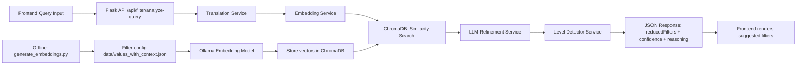
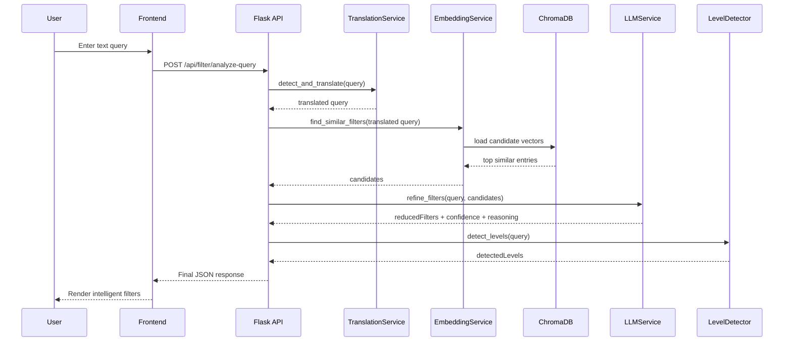

# Smart Filter Selector — Beginner Architecture Guide

This guide explains how this project turns a plain text query into smart filter suggestions using **Embeddings + LLM**.

---

## 1) What problem does this solve?

Classic filters force users to manually pick options from long lists.

This project lets users type a natural sentence like:
- “I’m building an ERTMS railway signaling system”

Then the backend automatically suggests the most relevant filters.

---

## 2) High-level architecture

Core files:
- API entry: `/app/routes/filter_routes.py`
- Pipeline orchestrator: `/app/services/hybrid_selector.py`
- Embeddings & semantic search: `/app/services/embedding_service.py`
- LLM refinement: `/app/services/llm_service.py`
- Language handling: `/app/services/translation_service.py`
- Level detection: `/app/services/level_detector.py`
- Embedding generation: `/scripts/generate_embeddings.py`

---

## 3) What are embeddings?

An **embedding** is a list of numbers (a vector) that represents meaning.

Texts with similar meaning have vectors that are close to each other.

Example idea:
- “rail signaling” and “train signaling” become close vectors.
- “cooking recipe” becomes far away.

In this project:
1. Every filter item is converted to an embedding (offline).
2. User query is converted to an embedding (runtime).
3. Similarity is computed between query vector and filter vectors.

---

## 4) How semantic search works here

Semantic search means “search by meaning”, not just exact keywords.

Project flow:
1. Load precomputed filter embeddings from ChromaDB.
2. Clean user query text.
3. Get query embedding from Ollama embedding model.
4. Compute cosine similarity against each filter embedding.
5. Keep top-K most similar candidates.

Result: you get candidate filters that are semantically relevant.

---

## 5) How the LLM is used

The LLM is **not** used as first-pass search.
It is used after semantic search, to refine candidates.

Why:
- Embeddings are fast and broad.
- LLM adds reasoning and better intent understanding.

LLM receives:
- translated user query
- candidate list from embedding search

LLM returns structured JSON:
- `reducedFilters`
- `confidence`
- `reasoning`

The prompt forces strict rules:
- only use provided candidates
- don’t invent new filter names/categories
- return valid JSON only

---

## 6) Full filter generation pipeline (runtime)

Implemented in `HybridFilterSelector.select_filters(...)`.

1. **Stage 0 — Translation**
   - Detect query language.
   - Translate to English if needed.

2. **Stage 1 — Embedding retrieval**
   - Semantic similarity search over filter vectors.
   - Get top candidate filters.

3. **Stage 2 — LLM refinement**
   - LLM chooses most relevant subset from candidates.
   - Produces confidence and reasoning.

4. **Stage 3 — Level detection**
   - Another LLM pass estimates:
     - experience
     - tool-expertise
     - language-level

5. **Response**
   - Return all outputs + stage timings.

---

## 7) Backend/frontend workflow

### Frontend
1. User writes natural query.
2. Frontend sends POST request to backend.
3. Frontend displays returned suggested filters with confidence.

### Backend
1. Validate request (Pydantic).
2. Run hybrid pipeline (translation → embedding search → LLM refinement → level detection).
3. Return structured JSON.

API used:
- `POST /api/filter/analyze-query`
- `GET /health`

---

## 8) Data flow diagram (request lifecycle)

---

## 9) Offline indexing flow (very important)

Before runtime requests work well, you must build embeddings:

1. Read filter config (`data/values_with_context.json`).
2. For each filter value, generate embedding via Ollama.
3. Save vectors + metadata into ChromaDB collection.

This is done by:
- `uv run scripts/generate_embeddings.py`

Think of this as building a “search index by meaning”.

---

## 10) Key beginner takeaways

- Embeddings = numeric meaning representation.
- Semantic search = fast first-pass candidate retrieval.
- LLM = smart second-pass selection + explanation.
- Hybrid pipeline = better speed + better quality than only one method.
- Precomputing filter embeddings is mandatory for good runtime performance.
