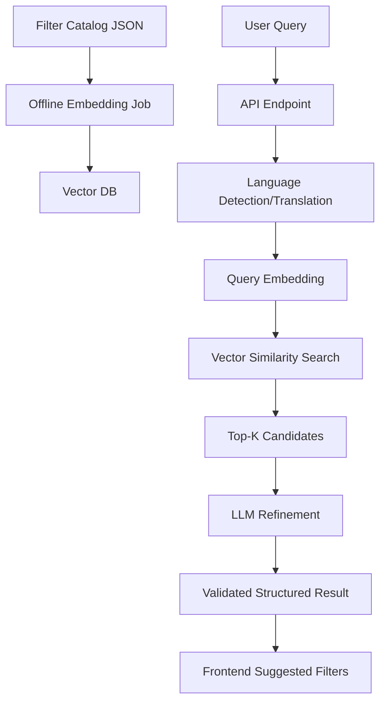

# Step-by-Step Guide: Build Intelligent AI Filters in Your Own Project

This guide helps you reproduce the same idea (Embeddings + LLM hybrid filtering) in your own app.

---

## Goal

You already have classic filters.  
You will add an AI layer that converts user text into the most relevant filter selections.

---

## Phase 1 — Prepare your filter data

1. Collect all your existing filter values.
2. Normalize them into a clean JSON structure.
3. For each filter value, store:
   - `name`
   - `category`
   - `subcategory` (optional)
   - `description` (important for semantic quality)

Why: better descriptions = better embeddings = better matching.

---

## Phase 2 — Build embedding index (offline job)

1. Choose embedding model (local Ollama or cloud provider).
2. Generate one embedding per filter value.
3. Store vectors + metadata in a vector database (ChromaDB, Pinecone, Weaviate, etc.).

Implementation pattern:
- Run this as a script/job (`generate_embeddings.py` style).
- Re-run whenever filter catalog changes.

---

## Phase 3 — Add backend endpoint for intelligent filtering

Create one endpoint (example):
- `POST /api/filter/analyze-query`

Input:
- `query` (user text)
- optional tuning options (`maxFilters`, `minConfidence`)

Output:
- selected filters
- confidence
- reasoning
- optional processing metadata

---

## Phase 4 — Runtime pipeline (core logic)

Implement this exact sequence:

1. **Language handling (optional but recommended)**
   - Detect language
   - Translate to one working language (e.g., English)

2. **Semantic candidate retrieval (embeddings)**
   - Embed query
   - Similarity search in vector DB
   - Keep top-K candidates

3. **LLM refinement**
   - Send query + candidates to LLM
   - Ask for strict JSON output
   - Force “use only given candidates”

4. **Post-processing**
   - Validate output schema
   - Apply confidence thresholds
   - Deduplicate and cap per category

5. **Return final JSON**

This is the same hybrid idea used in smart-filter-selector.

---

## Phase 5 — Prompt design for stable LLM output

Your prompt should include:
- clear task
- candidate list
- strict schema
- hard constraints

Essential constraints:
- output JSON only
- no invented filters
- no invented categories
- keep original candidate names exactly

Also add:
- fallback behavior when no candidates match

---

## Phase 6 — Frontend integration

1. Keep your current classic filter UI.
2. Add a text box: “Describe what you are looking for”.
3. On submit:
   - call intelligent endpoint
   - receive suggested filters
   - preselect/highlight those filters in UI
4. Let user edit suggestions manually (important for trust).

Best UX:
- show “why this was suggested” using reasoning
- show confidence badges

---

## Phase 7 — Evaluation and quality checks

Prepare a test query dataset with expected filters.

Measure:
- Precision
- Recall
- F1 score

Then tune:
- embedding model
- top-K candidate count
- LLM prompt
- confidence threshold

---

## Phase 8 — Production concerns

1. **Performance**
   - precompute embeddings
   - cache query embeddings
   - set request timeout

2. **Reliability**
   - if LLM fails, return embedding-only fallback
   - always return valid API schema

3. **Security**
   - sanitize user input size
   - validate LLM JSON
   - avoid exposing internal prompts

4. **Observability**
   - log each stage timing
   - track low-confidence cases

---

## Recommended implementation roadmap

1. Build embedding index first.
2. Implement embedding-only endpoint.
3. Add LLM refinement second.
4. Add translation and level detection later.
5. Add evaluation dataset and iterate quality.

This order gives quick wins and easier debugging.

---

## Minimal architecture template you can copy conceptually

---

## Common beginner mistakes to avoid

- Skipping descriptions in filter metadata
- Letting LLM choose from full catalog directly (too slow/noisy)
- Not forcing strict JSON output
- Not validating model output schema
- No fallback path when LLM is unavailable
- No evaluation dataset

---

## Final checklist for your own project

- [ ] Filter catalog normalized with metadata
- [ ] Embeddings generated and stored
- [ ] Semantic top-K retrieval working
- [ ] LLM refinement with strict schema
- [ ] Endpoint integrated into frontend
- [ ] Confidence + reasoning displayed
- [ ] Evaluation dataset and metrics in place
- [ ] Fallback behavior implemented

If you complete this checklist, you will have a solid intelligent filtering system similar to smart-filter-selector, and you will understand each piece instead of just copying code.
